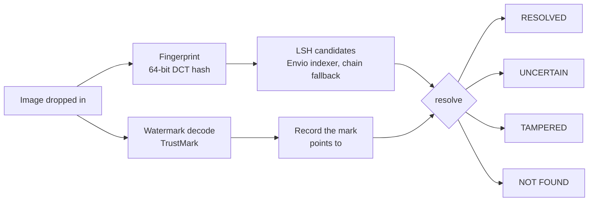

# Grain

**An open, onchain C2PA manifest repository. Find out who made an image, from the image itself — after screenshots, crops and re-encoding.**

**Live:** [grain-rho.vercel.app](https://grain-rho.vercel.app) · Monad testnet · built for [Metropolis](https://monad.xyz/developers/hackathons/metropolis), Track 04

> **Demo video:** _link goes here_

---

## The gap

C2PA solved the *format* of content provenance: a Content Credential is a signed manifest saying where a piece of media came from. But every screenshot and re-upload strips it. C2PA's answer is the **durable Content Credential** — an invisible watermark or a content fingerprint that survives the copy, looked up through a **Soft Binding Resolution API** in a **Manifest Repository**.

The spec defines the lookup. It does not say who runs the repository. Today that is a handful of private companies, and a record can be dropped or lost when one shuts down.

**Grain is that repository: open, permissionless, on Monad.** Nobody can delete your record, anyone can check an answer against it, and it works for people who have never touched crypto — one passkey prompt, no wallet, no seed phrase.

It is **not NFTs.** Records are found *by the content itself*, ten thousand copies of an image resolve to one record, and nothing is minted or traded. There is no ERC-721 anywhere in the project.

---

## How it works



**Two co-equal paths, run in parallel on every image.** A TrustMark watermark carries the record id; a perceptual fingerprint finds the record by what the picture looks like. Neither is a fallback — they fail in opposite directions, so each catches what the other drops (measured below).

**The anti-spoof check.** A watermark payload is not authenticated: anyone can stamp any record id onto any image. So the manifest also stores the fingerprint, and if the mark says one thing and the picture says another, Grain reports **TAMPERED** instead of attributing someone else's work. That is what C2PA's own guidance prescribes.

**Envio is the read path; the chain is the judge.** Every lookup is answered by an Envio indexer and checked against the contracts — [how, in detail, below](#how-envio-powers-grain).

**Everything runs in the browser.** Watermarking, fingerprinting and resolution happen on the person's device and the image is never uploaded; the browser reads Monad directly. The only server code is a small faucet that funds a new passkey account's first transactions.

---

## Why Monad

1. **Per-asset registration has to be cheap.** Every photo, edit and republish is a row. Measured: **~93k gas** to register once the index is warm. Manifests live in event data rather than storage, so the 16 KB cap costs only 2.7× a 256 B manifest.
2. **It has to be fast enough to disappear into a product.** End to end — passkey, watermark, name, confirmed on chain — registration takes **13–15 seconds** in a real browser, most of it watermarking on the device. The chain is not the slow part.
3. **Anyone can check the answer.** A database can tell you who made an image; it cannot let you verify that without trusting it. `FingerprintIndex.verify()` returns the distance between any record and any image **from the chain itself, for 8,687 gas** — the "verify on chain" link on every result.
4. **Nobody can retract your provenance**, and block order settles who registered first.

Identity is built on **Mera**, Monad's passkey account layer: a photographer's account is an ordinary EOA derived from their Face ID or fingerprint, and recoverable wherever the passkey syncs. One passkey yields three keys through separate PRF namespaces — a signing identity, unlinkable per-channel keys, and an encryption key for private manifest fields.

---

## How Envio powers Grain

A registry is only useful if you can search it. The contracts are built to *store* provenance cheaply and to *prove* an answer; they are not built to *search*. Envio HyperIndex is the layer that turns Grain's onchain events into something you can query in one round trip — and every screen that reads the registry is served by it.

### Why the chain alone isn't enough

Three properties of the contracts, each chosen for good reasons, make direct reads slow or impossible:

1. **Manifests live in event data, not storage.** That is what makes a 16 KB manifest cost only 2.7× a 256 B one. But it means reading a manifest back is a log search — and Monad's public RPC caps `eth_getLogs` at 100 blocks per call, so finding one record's event means first estimating which 100 blocks to look in.
2. **The fingerprint index is eight separate buckets.** Finding every record that might match an image means eight `queryBand` calls, then a `records()` read for every id they return.
3. **Some questions have no onchain answer at all.** "What has @grain-samples registered?" and "What was registered in the last hour?" would mean reading every record ever made. There is no mapping to read, by design: indexes like those would make every registration more expensive for a question only readers ask.

### What the indexer builds

The indexer ([`packages/indexer`](packages/indexer)) follows five events across the three contracts and maintains four entities:

| Event | Becomes |
|---|---|
| `GrainRegistry.ManifestRegistered` | a `Record` (fingerprint, creator, the full CBOR manifest, block, tx hash) plus **eight `FingerprintBand` rows** |
| `GrainRegistry.ManifestSuperseded` / `ManifestRevoked` | the record's `supersededBy` / `revoked`, copied onto its band rows |
| `CreatorRegistry.ProfileSet` | a `Creator` with handle, licence price and record count |
| `LicenseRegistry.LicenseGranted` | a `License` |

**The band rows are the core design decision.** The natural schema is an array of eight band values on each record, searched with an array-overlap operator. Instead, each band value is its own row keyed `band:value` (for example `3:217`), with `revoked` denormalised onto it. A fingerprint search becomes one indexed `key IN (8 keys)` lookup — a plain B-tree hit that returns the candidate records, their fingerprints and their creators' handles in a single GraphQL response.

### Where it's used

| Screen | Served by Envio | Without Envio |
|---|---|---|
| **Verify** — "who made this image?" | the candidate search: one query, **90 ms** | 8 band reads + a read per candidate, **980 ms** |
| **Record page** `/r/:id` | the manifest, block and transaction in one query | an estimated block window, then a `getLogs` search |
| **Creator page** `/c/:handle` | every record under a name, newest first | **not possible** without scanning every record |
| **Landing** — "Recently registered" | the latest records and registry totals, live | **not possible** without scanning every record |
| Register | — | writes go straight to the chain |

The last two rows are why Envio is part of the product rather than an optimisation: a creator's portfolio and a live feed of the registry simply don't exist without it.

### Why you don't have to trust it

An indexer is a database someone runs, and Grain's whole argument is that provenance shouldn't rest on a database you have to trust. So the index *proposes* and the chain *decides*:

- **Record pages re-read the record from contract storage** — creator, fingerprint, revocation — and take only the manifest from Envio. That manifest is hashed and compared with the `manifestHash` the contract stores before anything is shown. A wrong or tampered index cannot change what a record page says; it can only make the check fail, and the page shows that check.
- **Every verify result has "verify on chain".** One click calls `FingerprintIndex.verify()` from the visitor's browser and shows the distance the contract computes between the record and the image in front of them. It never touches the indexer.
- **The record page says where its data came from** — "Found via: Envio indexer, checked against the contract" — so the trust model is visible, not asserted.

### When it's behind, or down

- **Lag.** An index trails the chain by a few seconds. If Envio has no candidate close to an image, verify asks the chain before saying "no record", so an image registered moments ago is never reported as unregistered. A match returns straight from the index; only the not-found path pays for the check.
- **Outage.** Every query has a 4-second timeout and falls back: verify and record pages go to the chain and keep working, and the creator page says the listing is temporarily unavailable rather than claiming the creator has no work.

### Running it

Envio Cloud deploys the indexer from this repository's `envio` branch (root directory `packages/indexer`). It reads Monad testnet through HyperSync, starting from the contracts' deployment block. The app reads the endpoint from `NEXT_PUBLIC_ENVIO_GRAPHQL_URL`; locally, `pnpm --filter @grain/indexer dev` runs the same indexer against the same contracts. Measurements and schema notes are in [docs/INDEXER.md](docs/INDEXER.md).

---

## Measured, not asserted

### Robustness — 21 real images × 11 transformations

| Transformation | Watermark recovered | Fingerprint distance (median / max) | Resolves |
|---|---|---|---|
| None | 100% | 0 / 0 | **100%** |
| Screenshot | 100% | 0 / 0 | **100%** |
| JPEG quality 40 | 76% | 0 / 2 | **100%** |
| JPEG quality 20 | **43%** | 0 / 4 | **100%** |
| Downscale 50% / 25% | 100% | 0 / 2 | **100%** |
| Crop 10% | 100% | **12** / 28 | **100%** |
| Gaussian blur | 100% | 0 / 2 | **100%** |
| Social filter | 43% | 2 / 8 | 95% |
| Screenshot + JPEG 40 | 71% | 0 / 2 | **100%** |
| **Crop 25%** | 19% | 24 / 34 | **19%** |

JPEG 20 defeats the watermark but not the fingerprint; a 10% crop defeats the fingerprint but not the watermark. That is the case for two paths, in one table. **A 25% crop defeats both** — no threshold fixes it, because at that distance the picture genuinely is a different picture to a global hash. We say so rather than claim 100%. Full method in [docs/ROBUSTNESS.md](docs/ROBUSTNESS.md).

### The registry

| | |
|---|---|
| Records on chain | **500+** — 500 from a public photo corpus, labelled `@seed-corpus`; the rest registered through the app |
| LSH recall, 1,000 records, ≤7 bits flipped | **100%** — the pigeonhole guarantee behind the 8 × 8 band geometry |
| Verify, end to end in the browser | **~2 s** |
| First answer on a cold first visit | **5.8 s** — the fingerprint answers while the watermark model downloads |
| Candidate fan-out through the Envio indexer | **90 ms**, vs 980 ms reading 8 bands from the chain |

Gas figures in [docs/GAS.md](docs/GAS.md).

---

## Things we found, and fixed or stated

- **Adobe's TrustMark implementations disagree.** Grain's watermarks have to be readable by any TrustMark decoder, so we checked against all three Adobe ships. For the BCH_SUPER error-correction scheme, Adobe's Python reference and JavaScript library produce identical parity, but the Rust crate does not: it pads 40 data bits to 6 bytes where Python uses 5, and its leftover-byte loop drops Python's `pidx += 1`. So BCH_SUPER marks don't read across implementations. Grain ships **BCH_5**, which they all agree on: our browser encoder's codewords are bit-identical to Adobe's Python reference, and the Rust CLI reads them.
- **The tamper threshold in our own spec was wrong.** At the planned value of 12, a third of legitimate 10% crops were flagged as stolen credentials. Measured against 210 unrelated image pairs, **16** catches every genuine transfer while nearly eliminating false alarms.
- **The onchain index has a ceiling.** Over 913 real photos, the busiest LSH bucket held ~5× the average. Projected to a million records, reading it costs ~11.5 M gas in one call — inside a 150 M block limit, but within an order of magnitude. The production path is search off chain through the indexer, then prove the winner on chain with `verify()`.

## Honest about conformance

Grain is **C2PA-compatible, not C2PA-certified.** It implements the soft-binding assertion structure and the Soft Binding Resolution API shape; it does not run the `c2pa-rs` signing stack with certificates from the C2PA trust list. Our fingerprint algorithm, `grain.phash.v1`, is ours and not on the C2PA approved list — manifests say so with `algId: 0`. TrustMark Q is on it, as `algId: 4`.

**A testnet trade-off we haven't solved for mainnet:** a passkey account starts with no funds, and the no-wallet promise means a photographer can't top it up. So a small faucet pays for a new creator's first transactions. That is fine on testnet; on mainnet someone has to pay, and the funding model there is an open question.

---

## Run it yourself

| Contract — Monad testnet, chain 10143 | Address |
|---|---|
| GrainRegistry | [`0x180eC6A4FaF1a081e3eE3Fb4540fd3Df6d1A4c20`](https://testnet.monadexplorer.com/address/0x180eC6A4FaF1a081e3eE3Fb4540fd3Df6d1A4c20) |
| FingerprintIndex | [`0x68A3c6A0654af33b9f0E6Ba52ccc44B0C10e7203`](https://testnet.monadexplorer.com/address/0x68A3c6A0654af33b9f0E6Ba52ccc44B0C10e7203) |
| CreatorRegistry | [`0x783159d464B15180935222b342aEDc3Cf5ff2DE7`](https://testnet.monadexplorer.com/address/0x783159d464B15180935222b342aEDc3Cf5ff2DE7) |
| LicenseRegistry | [`0x71260B7e406566D0fd880320b58537eE27895B1E`](https://testnet.monadexplorer.com/address/0x71260B7e406566D0fd880320b58537eE27895B1E) |

```bash
pnpm install
./scripts/fetch-web-models.sh        # TrustMark models + WASM runtime, served by the app
pnpm --filter @grain/web dev

node --experimental-strip-types --test packages/grain-core/test/*.test.ts   # 45 tests
cd packages/contracts && forge test                                          # 31 tests
```

Registering needs a passkey that supports the WebAuthn PRF extension — Safari with iCloud Keychain, Chrome with Google Password Manager, Android, or 1Password. Without one, Grain offers to keep a key in the browser instead, and says what that gives up before you choose it.

| | |
|---|---|
| [SPEC.md](SPEC.md) | the design, and the decisions that are closed |
| [docs/ROBUSTNESS.md](docs/ROBUSTNESS.md) | the robustness matrix and thresholds |
| [docs/GAS.md](docs/GAS.md) | gas, and the LSH scaling ceiling |
| [docs/INDEXER.md](docs/INDEXER.md) | the Envio indexer |
| [packages/grain-core](packages/grain-core) | fingerprint, manifest, resolution — isomorphic TypeScript |
| [packages/contracts](packages/contracts) | the four contracts |
| [apps/web](apps/web) | the app, including the browser TrustMark port |

---

## Credits

TrustMark models and BCH library by [Adobe](https://github.com/adobe/trustmark), MIT. Seed corpus photographs via [Lorem Picsum](https://picsum.photos) / Unsplash — only their fingerprints are stored, never the images. Illustrations by [unDraw](https://undraw.co).

MIT © 2026 Jerry Musaga, Musaga Technology
